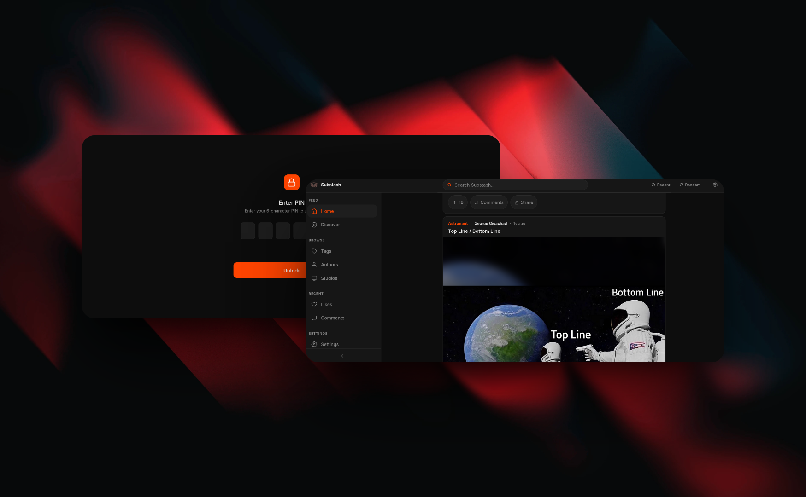

#  Substash

[](LICENSE)

Substash is a mobile-first, single-user web application that acts as a Reddit-esque frontend that'll allow you to consume media from [Stash](https://github.com/stashapp/stash/). Perfect for your personal meme-collections or for your personal media library, offering a familiar way to browse and enjoy your saved content on the go.



## Getting Started

You can run Substash locally using Docker Compose:

```yaml
services:
  substash:
    image: ghcr.io/hawkinslabdev/substash:latest
    ports:
      - "9456:9456"
    volumes:
      - ./data:/app/data
    environment:
      - TZ=Europe/Amsterdam
      - PUBLIC_APP_URL=http://localhost:9456
      - PUBLIC_APP_ORIGINS=http://localhost
      - PUBLIC_AUTH_COOKIE_SECURE=false
      - STASH_API_KEY=your_api_key_here
      - SHARE_SECRET=your_share_secret_here
      - DB_PATH=/app/data/substash.db
    restart: unless-stopped
```

Make sure the `./data` directory has correct permissions: `mkdir -p ./data && sudo chown 1000:1000 ./data`. Once the application is running, the interface is available (by default) from `http://localhost:9456`.

**Access Control** <br>
After setting up your instance, you can secure the web application from the `/settings` page by setting a 6-character pin.

**Filtering Media Content** <br>
Use the `STASH_TAGS_EXCLUDED` and `STASH_TAGS_INCLUDED` environment variables to manage media content. Note that inclusion tags will override exclusion tags if you've configured both.

**Metadata Management** <br>
By default, the application identifies media using tags. To ensure Reddit-style metadata is mapped correctly, you can customize the **JavaScript expression** provided in the **Settings** menu.

## License

This project is licensed under the **AGPL 3.0** license. See [LICENSE](LICENSE) for details.

## Contributing

Contributions including ideas, bug reports, and pull requests are welcome. Please open an issue to discuss any proposed changes or identified issues.
